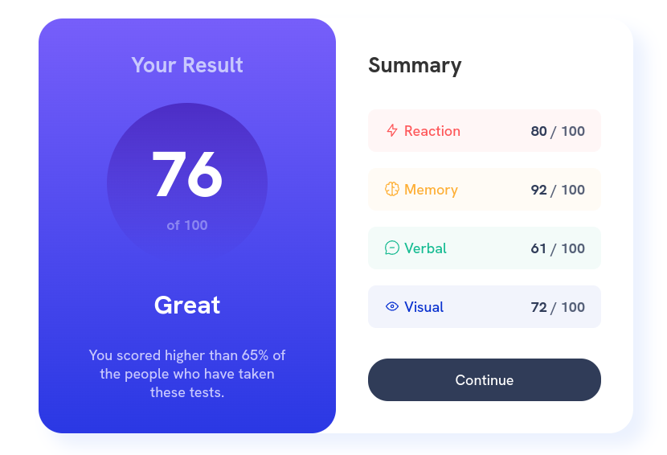

# Frontend Mentor - Results summary component solution

This is a solution to the [Results summary component challenge on Frontend Mentor](https://www.frontendmentor.io/challenges/results-summary-component-CE_K6s0maV). Frontend Mentor challenges help you improve your coding skills by building realistic projects. 

## Table of contents

- [Overview](#overview)
  - [The challenge](#the-challenge)
  - [Screenshot](#screenshot)
  - [Links](#links)
- [My process](#my-process)
  - [Built with](#built-with)
  - [What I learned](#what-i-learned)
  - [Useful resources](#useful-resources)
- [Author](#author)

## Overview

### The challenge

Users should be able to:

- View the optimal layout for the interface depending on their device's screen size
- See hover and focus states for all interactive elements on the page

### Screenshot

### Links

- Solution URL: [Solution page on Frontend Mentor](https://www.frontendmentor.io/solutions/solution-using-vanilla-css-and-flexbox-ODBNr2Vhkr)
- Live Site URL: [GitHub Pages](https://danayatsuta.github.io/fm-results-summary-component/)

## My process

### Built with

- Semantic HTML5 markup
- Flexbox

### What I learned

- Basic Flexbox skills

### Useful resources

- ["Flexbox Crash Course 2022" by Traversy Media](https://www.youtube.com/watch?v=3YW65K6LcIA) - This video course covers a lot of flexbox properties and how they can be applied in real world and was very helpful for learning Flexbox

## Author

- Frontend Mentor - [@danaYatsuta](https://www.frontendmentor.io/profile/danaYatsuta)
